# Motivation

## Sharp-interface multiphysics is a coupling problem

- Phase change, heat transfer, mass transfer, free boundaries
- Discontinuous coefficients and jump conditions across a moving interface
- Geometry and PDE are strongly coupled

**Sharp-interface phase-change problems are not only difficult because of physics. They are also difficult because of coupling.**

:::{.columns}
::: {.column width="50%"}
](figures/crystal.gif)
:::
::: {.column width="50%"}
](figures/bubble.gif)
:::
:::


## Two-phase sharp-interface model [^1]

Let $\Omega=\Omega^-(t)\cup\Gamma(t)\cup\Omega^+(t)$, where $\mathbf n$ points from $\Omega^-$ to $\Omega^+$.

In each phase $\Omega^\pm(t)$:

:::{.columns}
::: {.column width="50%"}

**Heat**
$$
\rho^\pm c_p^\pm
\left(\partial_t T^\pm + \mathbf u^\pm\!\cdot\!\nabla T^\pm\right)
=
\nabla\!\cdot\!\left(k^\pm \nabla T^\pm\right)
$$

**Species**
$$
\partial_t C^\pm + \mathbf u^\pm\!\cdot\!\nabla C^\pm
=
\nabla\!\cdot\!\left(D^\pm \nabla C^\pm\right)
$$
:::
::: {.column width="50%"}
**Flow**
$$
\rho^\pm D_t \mathbf u^\pm
=
\nabla\!\cdot\!\boldsymbol\sigma^\pm + \rho^\pm \mathbf g,
\qquad
\nabla\!\cdot\!\mathbf u^\pm = 0
$$
with
$$
\boldsymbol\sigma^\pm
=
-p^\pm \mathbf I
+
\mu^\pm\left(\nabla \mathbf u^\pm + \nabla \mathbf u^{\pm T}\right)
$$
:::
:::

> **Two phases in the bulk. One sharp interface for the coupling.**


[^1]: [@Bothe_2022]

## Interface conditions and phase change [^2]

On the moving interface $\Gamma(t)$ with velocity $\mathbf v$:
$$
\dot m = \rho^- \left(\mathbf u^- - \mathbf v\right)\!\cdot\!\mathbf n
= \rho^+ \left(\mathbf u^+ - \mathbf v\right)\!\cdot\!\mathbf n
$$

**Energy balance**
$$
\dot m L = \llbracket k \nabla T \cdot \mathbf n \rrbracket
$$

**Species balance**
$$
\dot m \llbracket C \rrbracket = \llbracket D \nabla C \cdot \mathbf n \rrbracket
$$

**Momentum balance**
$$
\llbracket \boldsymbol\sigma \cdot \mathbf n \rrbracket = \gamma \kappa \mathbf n,
\qquad
\llbracket \mathbf u \rrbracket = \mathbf 0
$$

**Closure**
$$
\llbracket T \rrbracket = 0,
\qquad
T_\Gamma = T_m + m_p C^- + \epsilon_\kappa \kappa + \epsilon_v \mathbf v\cdot\mathbf n,
\qquad
C^+ = k_e C^-
$$

> **The PDE determines the interfacial fluxes which determine the motion.**

[^2]: [@AZIZ19882335]

## What is the usual difficulty?

:::{.columns}
:::{.column width="50%"}
**Classical approaches**

- use filtered models (one-fluid, ...) [^6]
- decouple PDE and interface motion
- use explicit coupling
:::
:::{.column width="50%"}
**What we want instead**

- keep the interface **sharp**
- enforce jump conditions **directly**
- preserve local conservation
- solve the coupled problem **as a nonlinear system**
:::
:::

> **We do not approximate the coupling.**  
> **We solve it.**

[^6]: [@Kataoka1986LocalIF]

# Part I --- Fixed interface: sharp-interface model

## Start with the interface known

- Fixed embedded interface $\Gamma$
- Two phases $\Omega^-$ and $\Omega^+$
- Diffusion / heat / mass transfer with jump conditions

$$
-\nabla \cdot \left( \beta^\pm \nabla u^\pm \right) = f^\pm
\qquad \text{in } \Omega^\pm
$$

$$
\llbracket \alpha u \rrbracket + \gamma \nabla u^\pm \cdot \bm n = g_j,
\qquad
\llbracket \beta \nabla u \cdot \bm n \rrbracket = g_f
\qquad \text{on } \Gamma
$$

> **Before moving interfaces, the first requirement is already clear:**  
> **respect the geometry and respect the jumps.**

## Numerical idea: cut cells + interface unknowns

- Cartesian finite-volume discretization
- The interface cuts cells and faces
- Geometric moments encode the cut geometry
- Bulk unknowns and interface unknowns are solved together

$$
\text{bulk equations in } \Omega^\pm
\quad + \quad
\text{interface constraints on } \Gamma
\quad \Longrightarrow \quad
\text{one monolithic sparse solve}
$$

> **The interface is not a boundary artifact.**  
> **It is part of the discrete model.**

## Geometric moments are enough

:::{.columns}
::: {.column width="55%"}
The cut-cell operators are built from low-order moments only :
$$
V_i^\pm,
\qquad
A_f^\pm,
\qquad
\Gamma_i,
\qquad
\mathbf x_i^\pm,
\qquad
\mathbf x_i^\Gamma
$$

- $V_i^\pm$: phase volumes
- $A_f^\pm$: open face apertures
- $\Gamma_i$: interface measure in the cell
- $\mathbf x_i^\pm,\mathbf x_i^\Gamma$: barycenters

> **Geometry first. Operators next. Assembly after that.**
:::
::: {.column width="45%"}
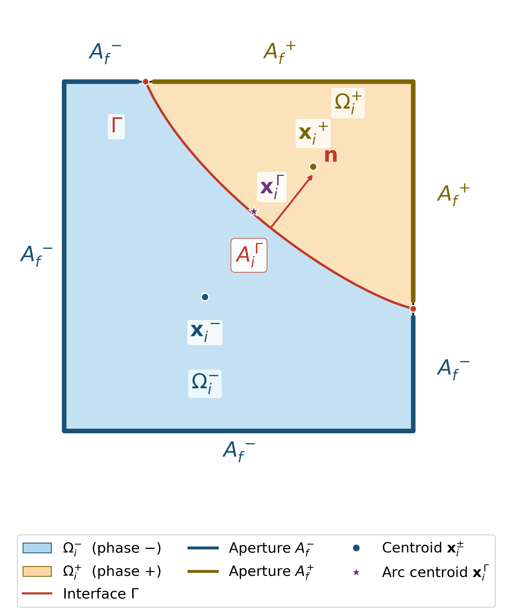
:::
:::

## One coupled linear system

Jump conditions become additional algebraic equations for the interface unknowns [^3].

$$
\underbrace{
\begin{bmatrix}
\text{bulk }^- & \text{coupling} & 0 & 0 \\
\text{flux jump} & \text{coupling} & \text{coupling} & 0 \\
0 & \text{coupling} & \text{coupling} & \text{scalar jump} \\
0 & 0 & \text{coupling} & \text{bulk }^+
\end{bmatrix}}_{\text{one sharp-interface system}}
\begin{bmatrix}
u^{\omega-} \\
u^{\gamma-} \\
u^{\gamma+} \\
u^{\omega+}
\end{bmatrix}
=
\begin{bmatrix}
b^- \\
g_f \\
g_j \\
b^+
\end{bmatrix}
$$

- no ghost-fluid or immersed-boundary interpolation
- no diffuse effective coefficients
- jump laws enforced on the interface unknowns themselves

> **A sharp interface deserves a sharp algebraic system.**

[^3]: [@libat-space-time-2026]


## Result: mass transfer across a static bubble (2D)

:::{.columns}
::: {.column width="52%"}
Bulk diffusion in each phase:
$$
\partial_t C^\pm=\nabla\!\cdot(D^\pm\nabla C^\pm)
$$

Sharp interfacial coupling:
$$
\llbracket C \rrbracket=(H-1)C^-,
\qquad
\llbracket D\nabla C\cdot\mathbf n \rrbracket=0
$$

- arbitrary jump ratio $H$
- flux continuity enforced sharply
- clear gain over one-fluid formulations

> **The gain is not cosmetic.**  
> **It grows with refinement.**
:::

::: {.column width="48%"}
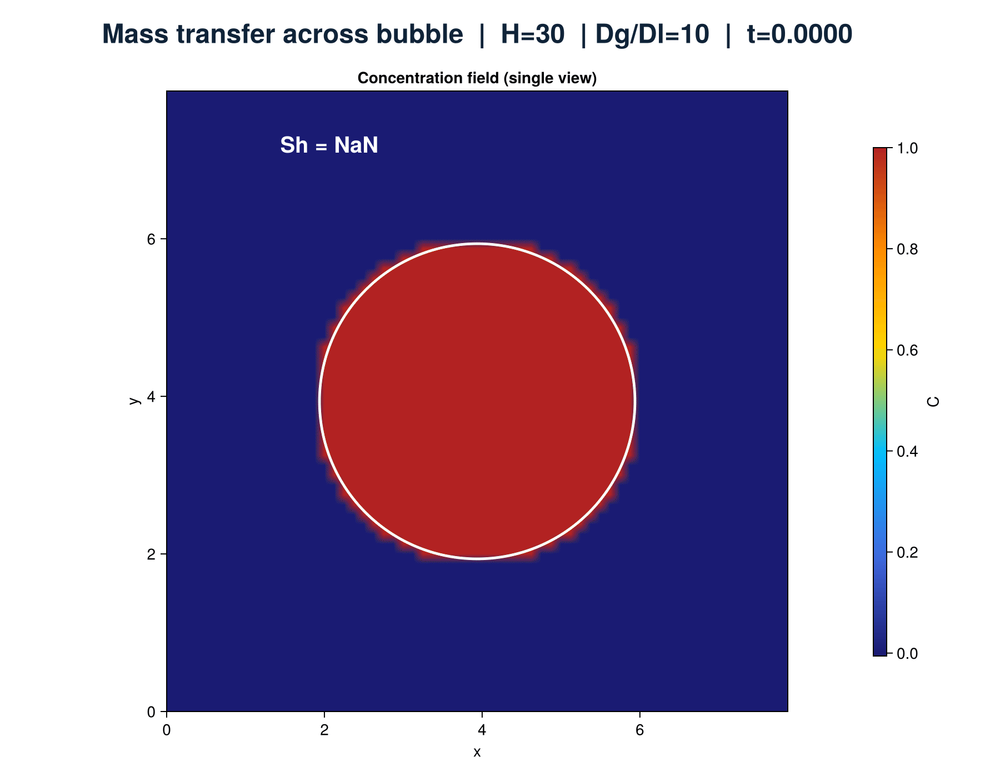{width="100%"}

<div style="font-size:0.58em; margin-top:0.4em;">

| $N_{\text{diam}}$ | Our method | One-fluid | Gain |
|---:|---:|---:|---:|
| 8   | $3.24\times 10^{-4}$ | $5.45\times 10^{-3}$ | $\times 16.8$ |
| 16  | $5.25\times 10^{-5}$ | $2.75\times 10^{-3}$ | $\times 52.5$ |
| 32  | $6.46\times 10^{-6}$ | $1.42\times 10^{-3}$ | $\times 220$ |
| 128 | $1.94\times 10^{-7}$ | $3.32\times 10^{-4}$ | $\times 1707$ |

</div>

<div style="font-size:0.58em; margin-top:-0.3em;">
Observed order: our method $\approx 2.2$ \quad vs \quad one-fluid $\approx 1.1$
</div>
:::
:::


## Moving interfaces require space-time geometry

When $\Gamma(t)$ moves, cells can appear or disappear.

:::{.columns}
:::{.column width="54%"}
**What space-time finite volumes fix**

- fresh / dead cells become ordinary space-time cut cells
- geometry and conservation are handled on the same slab
- no ad hoc merging or repair step

A local geometric conservation law is built in:
$$
V_{n+1,i}^\pm - V_{n,i}^\pm
\mp
\int_{t_n}^{t_{n+1}}\!\int_{\Gamma_i(t)} \mathbf v \cdot \mathbf n \,dS\,dt = 0
$$
:::
:::{.column width="46%"}
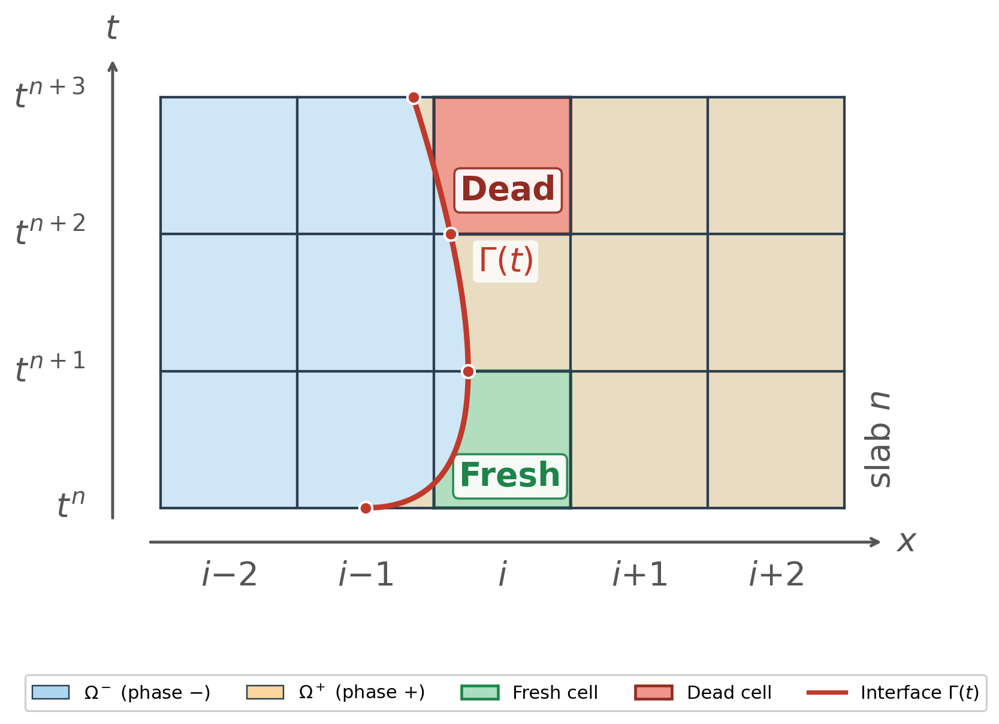
:::
:::

> **Fresh cells and dead cells are not special cases.**  
> **They are just space-time cut cells.**

## Result: prescribed moving interface with Robin transfer

:::{.columns}
::: {.column width="52%"}
Prescribed moving interface $\Gamma(t)$, with Robin transfer law:
$$
\alpha \phi + \beta\, D\nabla\phi\!\cdot\!\mathbf n = g
\qquad \text{on }\Gamma(t)
$$

What this shows:

- moving geometry handled in **space-time**
- fresh/dead cells treated naturally
- Robin transfer remains **sharp**
- relevant for **heterogeneous surface reaction**

> **The geometry moves.**  
> **The interface law stays sharp.**
:::

::: {.column width="48%"}
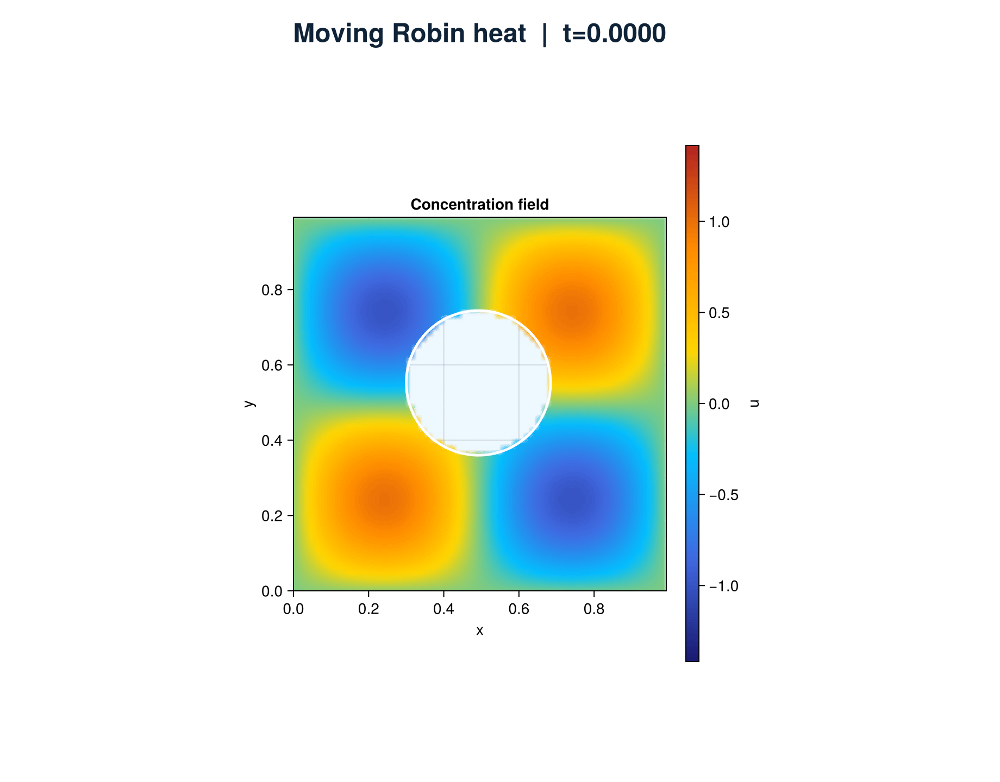{width="100%"}

<div style="font-size:0.56em; margin-top:0.45em;">

| $h$ | All cells | Full cells | Cut cells |
|---:|---:|---:|---:|
| 0.25    | $2.49\times 10^{-1}$ | $9.54\times 10^{-2}$ | $2.30\times 10^{-1}$ |
| 0.125   | $4.27\times 10^{-2}$ | $3.80\times 10^{-2}$ | $1.96\times 10^{-2}$ |
| 0.0625  | $1.42\times 10^{-2}$ | $1.33\times 10^{-2}$ | $4.96\times 10^{-3}$ |
| 0.03125 | $5.37\times 10^{-3}$ | $5.32\times 10^{-3}$ | $7.58\times 10^{-4}$ |

</div>

<div style="font-size:0.56em; margin-top:-0.3em;">
Observed order: all $=1.79$ \quad full $=1.72$ \quad cut $=2.1$
</div>
:::
:::


## What fixed-interface results already show

> L. Libat, C. Selçuk, E. Chénier, V. Le Chenadec, "A Space-Time Cartesian Cut-Cell Method for Two-Phase Diffusion Problems using a Two-Fluid Approach", Journal of Computational Physics (In review), 2026.

- Vast range of sharp jumps types and discontinuities can be handled (Robin, Nonlinear, Extreme jump ratios, etc.)
- Excellent accuracy on difficult cut-cell configurations
- The same framework already works for prescribed moving interfaces in space-time


> **The static and prescribed-motion story is already strong.**  
> **Now the real difficulty starts: free boundaries.**


# Part II --- Phase change and nonlinear coupling

## Phase change turns the interface into an unknown

For a Stefan-type problem,
$$
V_n \propto \llbracket q \rrbracket,
\qquad
q = -\beta \nabla u \cdot \bm n
$$

So the logic becomes

$$
\text{PDE solution}
\;\Longleftrightarrow\;
\text{interfacial flux}
\;\Longleftrightarrow\;
\text{interface motion}
$$

- solve PDE $\Rightarrow$ get flux
- get flux $\Rightarrow$ move interface
- move interface $\Rightarrow$ change geometry
- change geometry $\Rightarrow$ new PDE

> **The interface is not a boundary condition.**  
> **It is an unknown.**

## Front-Tracking is the right approach for sharpness

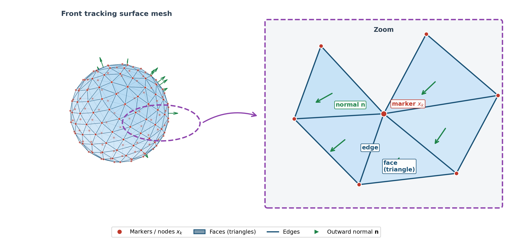{width="100%"}

## The coupled nonlinear problem

Let $X_{n+1}$ denote the front degrees of freedom at the end of the time step.
Then

$$
X_{n+1}
\;\longrightarrow\;
\Gamma_h^{n+1}(X_{n+1})
\;\longrightarrow\;
\mathcal M_{n+\frac12}(X_{n+1})
$$

The bulk equations and the Stefan balance define

$$
\mathbf F_H^{+}(\mathbf T_{n+1}^{+},X_{n+1})=\mathbf 0,
\qquad
\mathbf F_H^{-}(\mathbf T_{n+1}^{-},X_{n+1})=\mathbf 0,
$$
$$
\mathbf F_S(\mathbf T_{n+1}^{+},\mathbf T_{n+1}^{-},X_{n+1})=\mathbf 0
$$

With
$$
U=
\begin{bmatrix}
\mathbf T_{n+1}^{+} \\
\mathbf T_{n+1}^{-} \\
X_{n+1}
\end{bmatrix},
\qquad
\mathbf F(U)=\mathbf 0
$$

> **The unknown is not only the field.**  
> **The unknown is field + geometry.**

## Why splitting is not enough

:::{.columns}
:::{.column width="48%" .fragment}
**Classical split logic**

$$
X_n
\;\to\;
\widetilde X_{n+1}
\;\overset{\mathcal M(\widetilde X_{n+1})}{\to}\;
\widetilde T_{n+1}^\pm
\;\to\;
X_{n+1}^{\mathrm{split}}
$$

- solve on one geometry
- accept another geometry
- never enforce Stefan again on the final slab
:::
:::{.column width="52%" .fragment}
**What goes wrong**

$$
R_{i,j}(X_{n+1}^{\mathrm{split}},
\widetilde T_{n+1}^{+},
\widetilde T_{n+1}^{-}) \neq 0
$$

- end-of-step Stefan residual remains nonzero
- interface error may dominate the bulk discretization error
- the stronger the gradients, the worse the mismatch
:::
:::

:::{.fragment}
> **If the coupling is the problem, decoupling is not the solution.**
:::

## Nonlinear correction loop: the basic idea

At iteration $k$:

1. assume a candidate interface $\Gamma^{(k)}$
2. rebuild cut-cell and space-time geometry
3. solve the bulk PDE on that geometry
4. evaluate the discrete Stefan residual
5. correct the interface
6. repeat until the residual is small

$$
\Gamma^{(k+1)} = \Gamma^{(k)} + \delta \Gamma^{(k)}
$$

> **This is not “move first, solve later”.**  
> **This is a nonlinear correction loop.**

## Two correction strategies, same residual

:::{.columns}
:::{.column width="50%" .fragment}
**Least-squares correction**

Solve for a front displacement $d$ by minimizing
$$
J(d) =
\frac12\|r(d)\|_W^2
+
\frac{\eta}{2}\|L_\Gamma d\|^2
$$

$$
d^* = \arg\min_d J(d)
$$

- global correction
- smooth and robust
- closest in spirit to a reduced Newton step
:::
:::{.column width="50%" .fragment}
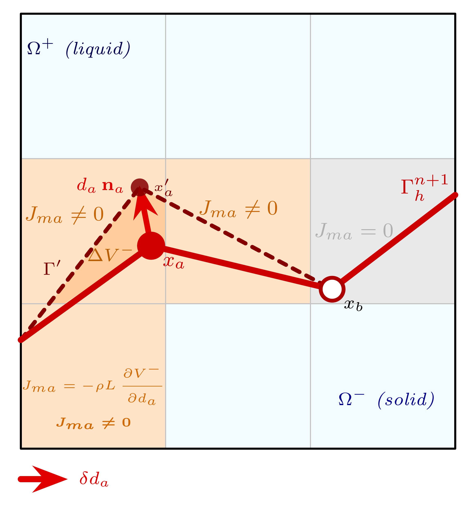{width="80%"}
:::
:::

## Two correction strategies, same residual

:::{.columns}
:::{.column width="50%" .fragment}
**Residual redistribution**

Convert the local Stefan residual into a front displacement 

$$
\delta d^{(k)} = -\lambda^{(k)}\;S_\Gamma\;A_{v\leftarrow\sigma}^{(k)}\;C_{\sigma\leftarrow c}^{(k)}\;D_c^{(k)\,-1}\;r^{(k)}.
$$

$$
\Gamma^{(k+1)} = \Gamma^{(k)} + \delta d^{(k)}
$$


- local correction
- more aggressive than Gauss--Newton
:::
:::{.column width="50%" .fragment}
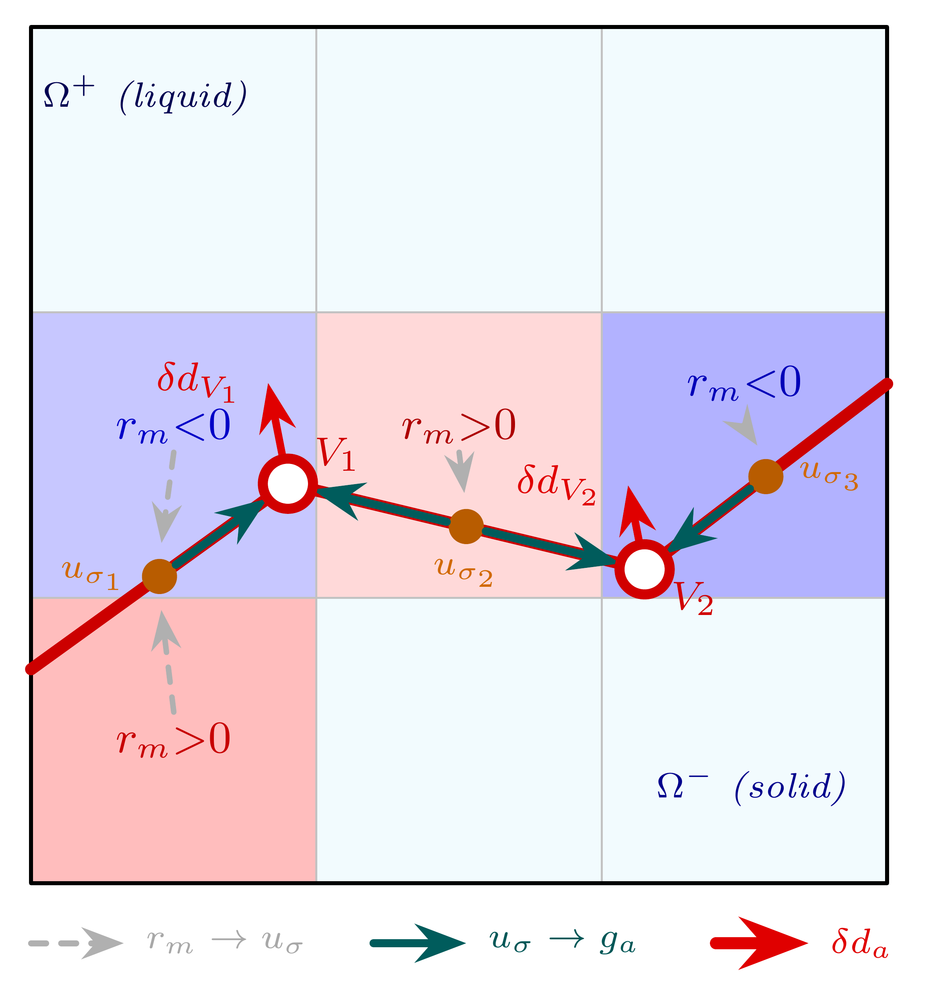{width="80%"}
:::
:::

::: {.fragment}
> **Same residual. Different front updates. Same coupled problem.**
:::

## A reduced Jacobian: differentiate geometry, not flux

For the Stefan residual in each cut cell,
$$
r_i(X_{n+1})
=
\rho L\Big(V_{i,n+1}^-(X_{n+1})-V_{i,n}^-\Big)
-
\Phi_i(X_{n+1}),
$$

with $\Phi_i$ the time-integrated discrete flux jump.

A full Newton Jacobian would require
$$
\frac{\partial r_i}{\partial X_j}
=
\rho L\,\frac{\partial V_{i,n+1}^-}{\partial X_j}
-
\frac{\partial \Phi_i}{\partial X_j},
$$
with
$$
\frac{\partial \Phi_i}{\partial X_j}
=
\frac{\partial \Phi_i}{\partial T}\frac{\partial T}{\partial X_j}
+
\frac{\partial \Phi_i}{\partial \mathcal M}\frac{\partial \mathcal M}{\partial X_j}.
$$

## A reduced Jacobian: differentiate geometry, not flux

:::{.columns}
::: {.column width="50%"}
**What we keep**
$$
J_{ij}^{\mathrm{geo}}
\;\approx\;
\rho L\,\frac{\partial V_{i,n+1}^-}{\partial X_j}
$$

because it is easy (analytical) :

- polytope-based differentiable geometry [^4]
- captures the leading effect of front motion
- cheap and robust
:::
::: {.column width="50%"}
**What we neglect**
$$
\frac{\partial \Phi_i}{\partial X_j}
$$

because it would require differentiating:

- the reconstructed geometry
- the discrete operators / moments
- the PDE solution itself
- the interfacial flux evaluation
:::
:::
    
> **This is not a full Jacobian. It is a reduced geometric Jacobian.**

[^4]: [@Crane:2013:DGP]

## Why Newton?

- The difficulty is the nonlinear PDE--geometry coupling
- Newton gives the right viewpoint: solve the coupled residual, not the subproblems separately
- In practice we use a **reduced Jacobian**, built from the geometric part of the Stefan residual
- This already gives a systematic nonlinear correction mechanism

$$
\mathbf J_{\mathrm{geo}}(U^{(k)})\,\delta U^{(k)} \approx -\mathbf F(U^{(k)})
$$

> **Sharp-interface phase change is a nonlinear problem.**  
> **So we use nonlinear thinking.**
    
::: center
**Newton is all you need.**
:::

# Results

## Coupled Nonlinear corrections converge rapidly

:::{.columns}
::: {.column width="52%"}
- **1st iteration** : classical advection algorithm
- **Next iterations** : nonlinear correction loop
- 4-15 iterations to converge
- Convergence is essentially monotone and robust (Fixed Point Structure of the Nonlinear System) [^5]

> **The nonlinear coupling correction is effective.**
:::
::: {.column width="48%"}

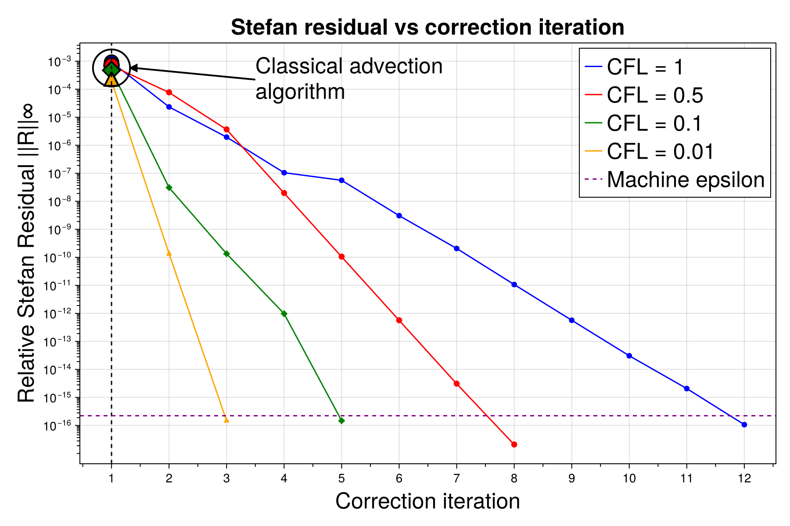{width="100%"}
:::
:::

[^5]: [@Libat_2026]


## Planar Stefan front — coupled correction converges cleanly

:::{.columns}
::: {.column width="52%"}
Two-phase melting problem of a planar interface.

What we observe:

- temperature and interface both converge cleanly
- fewer than $10$ inner iterations are usually enough
- the Stefan residual is driven essentially to machine precision

> **The coupling correction is effective.**
:::

::: {.column width="48%"}
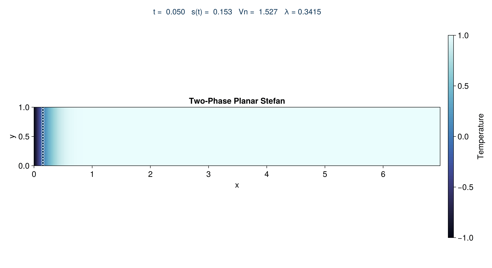{width="100%"}

<div style="font-size:0.56em; margin-top:0.4em;">

| Method | $\varepsilon_T$ finest | $\varepsilon_s$ finest | rate $T$ | rate $s$ |
|---|---:|---:|---:|---:|
| LM coupled | $4.62\times10^{-7}$ | $3.37\times10^{-6}$ | $2.31$ | $2.02$ |
| Redistribution | $2.26\times10^{-6}$ | $3.36\times10^{-6}$ | $2.13$ | $2.08$ |

</div>

<div style="font-size:0.56em; margin-top:-0.3em;">
Both coupled corrections recover about second-order front accuracy.
</div>
:::
:::

## Frank sphere — predictor-only is not enough

:::{.columns}
::: {.column width="52%"}
Predictor-only strategy:

- solve, advance geometry, repeat

What happens:

- temperature still converges
- the front error is non-monotone
- no meaningful convergence for the interface

> **The bulk solve is not the main issue.**  
> **The missing ingredient is the coupling correction.**
:::

::: {.column width="48%"}

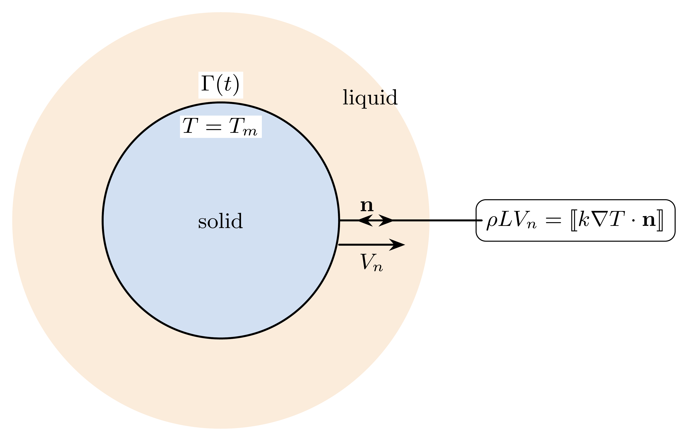{width="100%"}


<div style="font-size:0.56em; margin-top:0.4em;">

| Method | $\varepsilon_T$ finest | $\varepsilon_r$ finest | rate $T$ | rate $r$ |
|---|---:|---:|---:|---:|
| Predictor-only | $2.68\times10^{-3}$ | $1.05\times10^{-2}$ | $1.3$ | $-0.08$ |

</div>

<div style="font-size:0.56em; margin-top:-0.3em;">
Front accuracy stalls even though the bulk temperature error still decreases.
</div>
:::
:::

## Frank sphere — coupled correction restores front convergence

:::{.columns}
::: {.column width="55%"}
Coupled strategies:

- **Levenberg--Marquardt**
- **Residual redistribution**

What changes:

- clean temperature convergence
- clean front convergence
- much smaller final radius error

> **Once the coupling is enforced,**  
> **second-order front accuracy comes back.**
:::

::: {.column width="45%"}
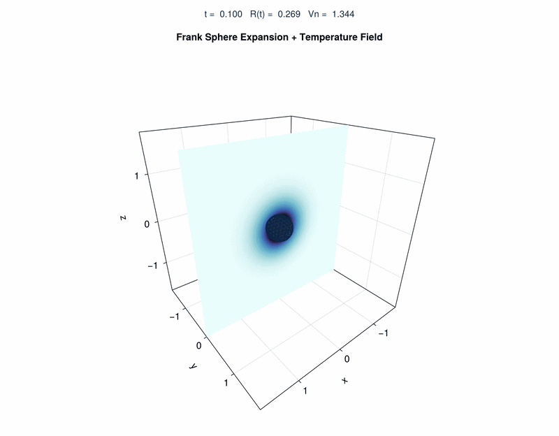{width="100%"}

<div style="font-size:0.56em; margin-top:0.4em;">

| Method | $\varepsilon_T$ finest | $\varepsilon_r$ finest | rate $T$ | rate $r$ |
|---|---:|---:|---:|---:|
| Predictor-only | $2.68\times10^{-3}$ | $1.05\times10^{-2}$ | $1.3$ | $-0.08$ |
| LM coupled | $8.79\times10^{-4}$ | $2.75\times10^{-4}$ | $2.14$ | $1.89$ |
| Redistribution | $1.13\times10^{-3}$ | $1.53\times10^{-3}$ | $2.24$ | $1.58$ |

</div>

<div style="font-size:0.56em; margin-top:-0.3em;">
$\varepsilon_T$ and $\varepsilon_r$ errors are $1$ to $2$ orders of magnitude smaller than litterature.
</div>
:::
:::

## Beyond the smooth benchmark

- stronger front deformations
- dendritic decay / instability-type configurations
- extension to temperature + species + flow

> **Once the interface is treated as an unknown, the method becomes naturally multiphysics-ready.**

## Beyond the smooth benchmark

> **Once the interface is treated as an unknown, the method becomes naturally multiphysics-ready.**

:::{.columns}
::: {.column width="50%"}
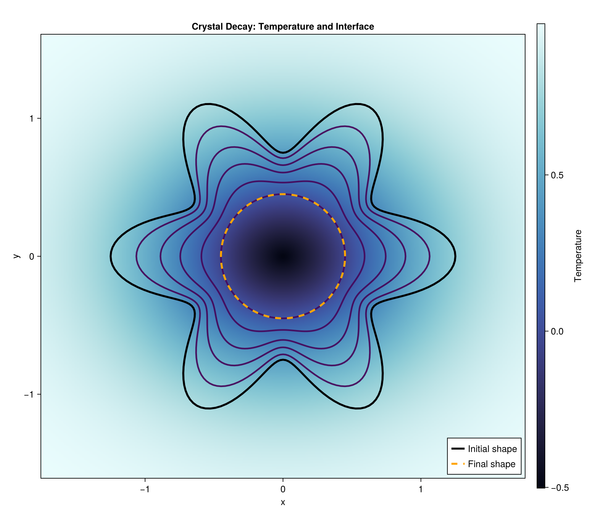{width="50%"}
:::
::: {.column width="50%"}
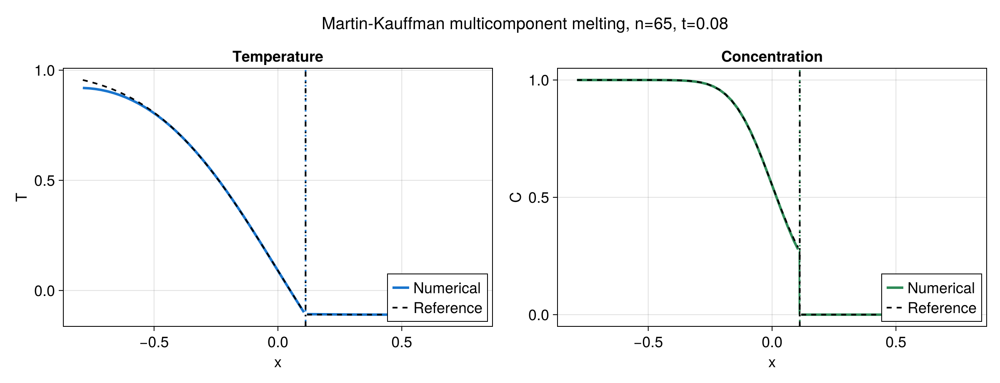{width="100%"}
:::
:::

> **What about Navier-Stokes coupling?** (see appendix and questions)


# Conclusion

## What to remember

1. Fixed-interface sharp two-fluid discretization already beats classical approaches
2. For phase change, the real difficulty is the PDE-geometry coupling
3. The interface must be treated as an unknown
4. Space-time cut cells give the right moving-geometry framework
5. Nonlinear correction is the natural way to solve the full problem

> **The interface is not a boundary condition.**  
> **It is an unknown.**

::: center
**In Newton we trust.**
:::

## Thank you {.center}

::: center
**Questions?**
:::

# References {.appendix visibility="uncounted"}

::: {#refs}
:::

# Appendix {.appendix visibility="uncounted"}

## Appendix — Navier--Stokes solver: current status

:::{.columns}
::: {.column width="42%"}

**Sharp-interface coupling**

$$
\llbracket \boldsymbol{\sigma}\cdot\mathbf n \rrbracket = \gamma \kappa \mathbf n,
$$
$$
\llbracket \mathbf u \rrbracket = \mathbf 0
$$

\medskip

**Validated so far**

- two-phase Stokes/Navier-Stokes flow
- Fixed interface and prescribed motion
- Various sharp jump conditions

:::
::: {.column width="58%"}

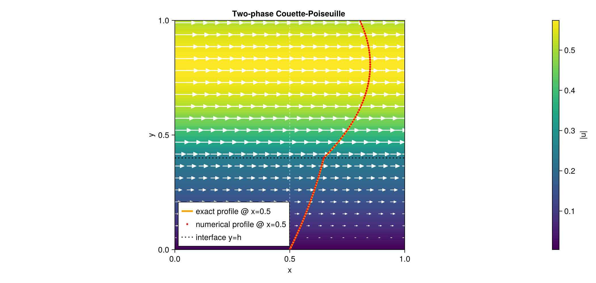{width="100%"}


<div style="font-size:0.60em;">

| $N$ | $\varepsilon_{u_1}$ | $\varepsilon_{u_2}$ |
|---:|---:|---:|
| 32  | $4.84\times10^{-3}$ | $4.54\times10^{-3}$ |
| 64  | $1.83\times10^{-3}$ | $1.75\times10^{-3}$ |
| 96  | $8.13\times10^{-4}$ | $7.79\times10^{-4}$ |
| 128 | $3.63\times10^{-4}$ | $3.48\times10^{-4}$ |
| Order | $1.99$ | $1.99$ |

</div>

:::
:::

> **The sharp two-phase Stokes/Navier--Stokes solver is in place.**

## Appendix — Capillary equilibrium is recovered

:::{.columns}
::: {.column width="50%"}

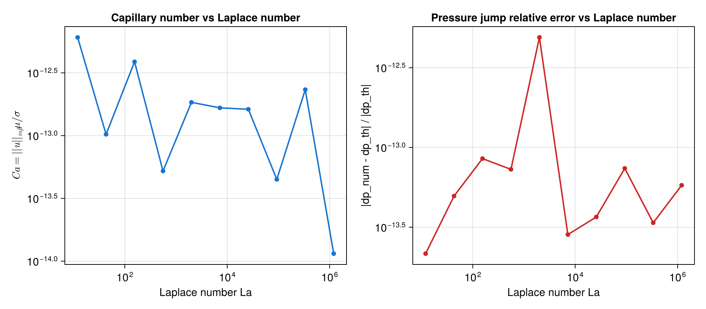{width="100%"}

:::
::: {.column width="50%"}

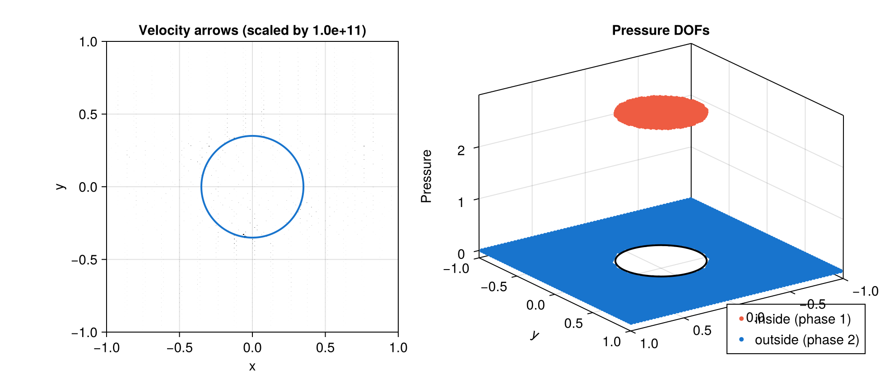{width="100%"}

:::
:::

$$
\llbracket \boldsymbol{\sigma}\cdot\mathbf n \rrbracket = \gamma \kappa \mathbf n
$$

- static circle
- correct Laplace pressure jump
- no parasitic currents at equilibrium

> **When surface tension and pressure balance exactly, the velocity stays at machine precision.**

## Appendix — Why Navier--Stokes + phase change is harder

:::{.columns}
::: {.column width="56%"}

On the same moving interface, we must enforce

$$
\llbracket \boldsymbol{\sigma}\cdot\mathbf n \rrbracket = \gamma \kappa \mathbf n,
\qquad
\llbracket \mathbf u \rrbracket = \mathbf 0
$$

$$
\dot m\,L = \llbracket k \nabla T \cdot \mathbf n \rrbracket,
\qquad
\dot m\,\llbracket C \rrbracket = \llbracket D \nabla C \cdot \mathbf n \rrbracket
$$

$$
\dot m = \rho^\pm (\mathbf u^\pm-\mathbf v)\cdot\mathbf n
$$

**Why it is harder**

- one interface, several jump laws
- flow, heat, solute, and motion are coupled
- curvature enters both stress and thermodynamics

:::
::: {.column width="44%"}

$$
\text{flow} \;\Longrightarrow\; \text{stress}
$$

$$
\text{heat / solute} \;\Longrightarrow\; \dot m
$$

$$
\text{stress} + \dot m \;\Longrightarrow\; \Gamma(t)
$$

$$
\Gamma(t) \;\Longrightarrow\; \text{jumps, curvature, geometry}
$$

> **One interface. One coupled nonlinear problem.**

:::
:::

> **The interface is not only transported by the flow: it is also created by phase change.**

## Appendix — Interfacial thermodynamics

:::{.columns}
::: {.column width="54%"}

The interface temperature is not fixed by $T_m$ alone:

$$
T_\Gamma = T_m + m_p\,C^- + \epsilon_\kappa \kappa + \epsilon_v\,(\mathbf v\!\cdot\!\mathbf n)
$$

It is shifted by:

- **composition** through the **liquidus slope** $m_p$
- **curvature** through the **Gibbs--Thomson effect**
- **motion** through **kinetic undercooling**

$$
C^+ = k_e C^-
$$

> **Composition sets the local equilibrium, curvature and motion correct it.**
:::

::: {.column width="46%"}

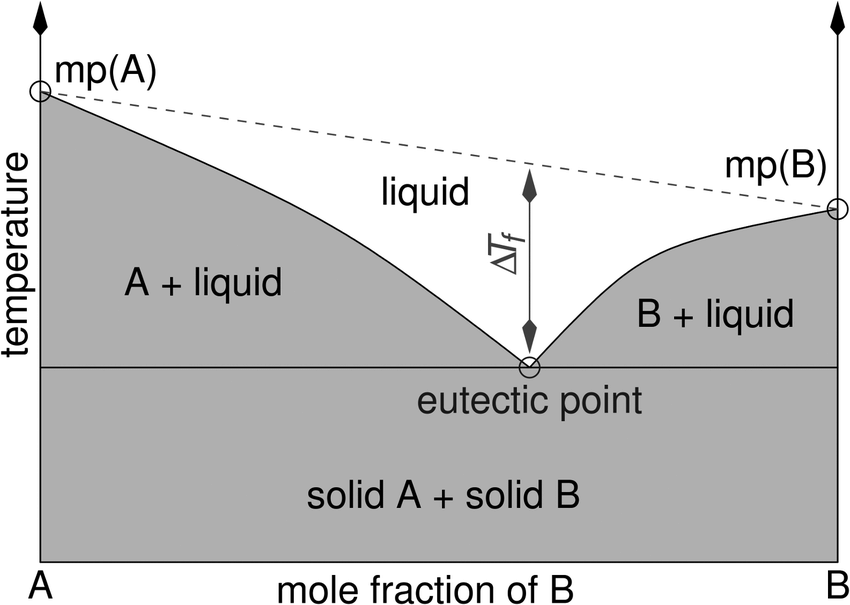{width=80%}

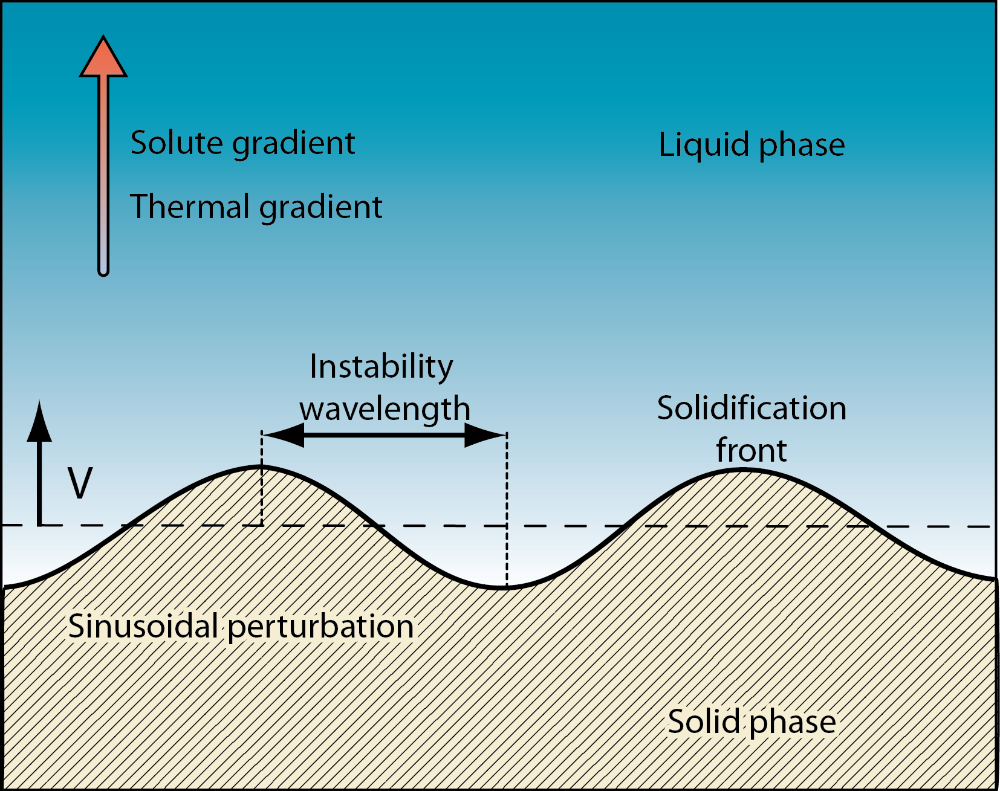{width=80%}

:::
:::

## Appendix --- Nonlinear free-boundary loop

```julia
Γk = predictor(Γn)
for k in 1:maxiter
    moments = spacetime_moments(Γn, Γk)
    T⁻, T⁺  = solve_bulk_diffusion(moments)
    r       = stefan_residual(T⁻, T⁺, Γk, moments)
    converged(r) && break
    Γk      = correct_front(Γk, r)   # LM or redistribution
end
accept!(Γk)
```

> **Same geometry for the PDE solve and for the Stefan residual.**